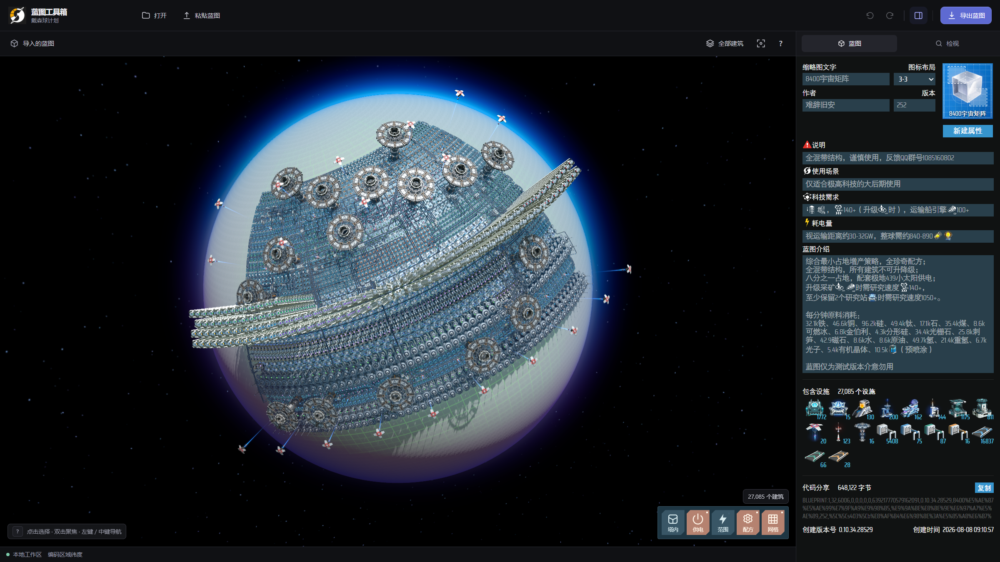
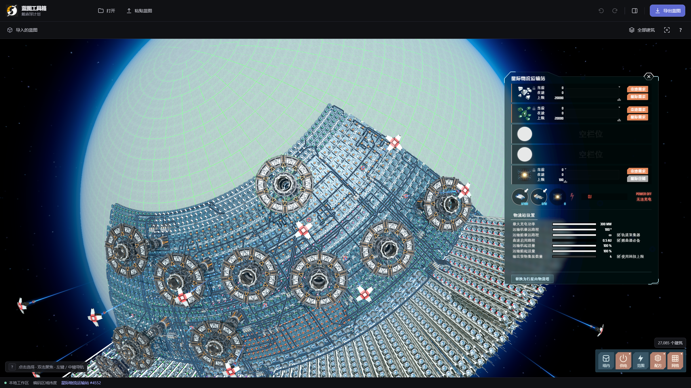
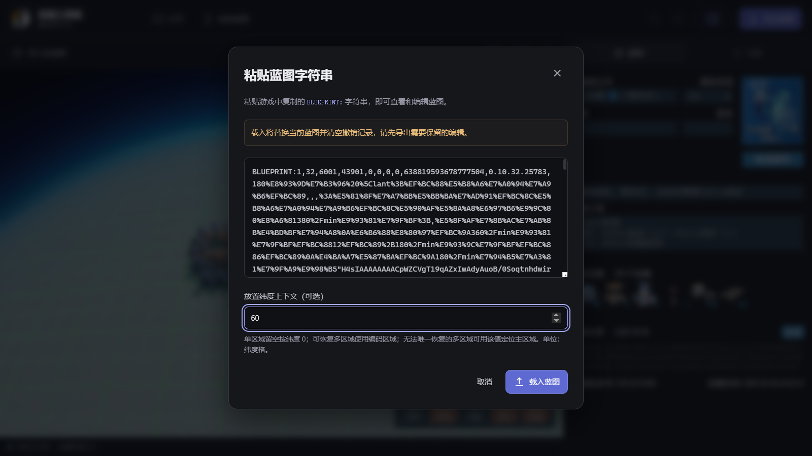
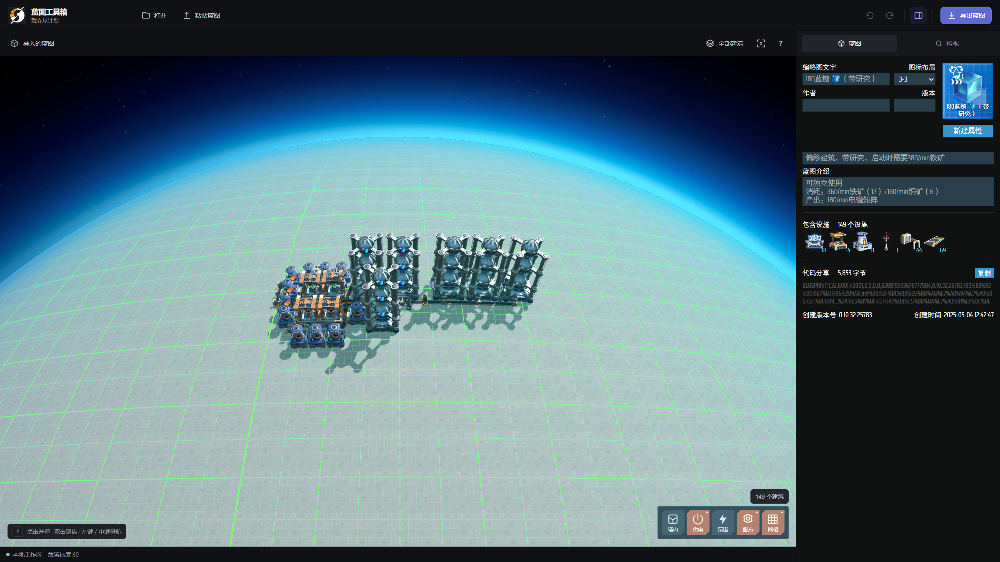
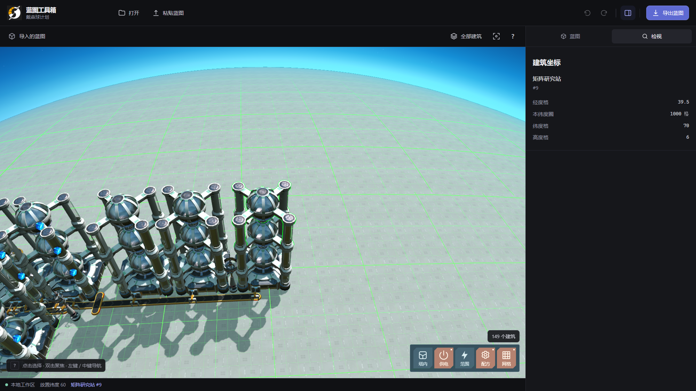

# DSP Blueprint Studio

**戴森球计划蓝图预览与编辑工具**

导入已有蓝图，在三维星球视图中查看布局、编辑蓝图信息和物流塔设置，再复制或导出到游戏。建筑模型与主要编辑界面沿用游戏中的视觉风格，操作直观熟悉。

尤其适合调整极密铺蓝图的物流塔参数：直接编辑蓝图并保留原有建筑坐标，省去在游戏中先铺设、修改、再重新框选保存的过程，避免反复铺设与复制带来的坐标精度问题。

## 界面预览

### 蓝图总览

旋转、缩放和查看完整蓝图；右侧可编辑名称、图标与介绍，并查看设施清单。

### 物流塔编辑

选择物流塔即可查看和修改物品槽位、供需模式、库存上限及运输设置，也可切换行星物流运输站与星际物流运输站。

以上两张截图使用 `[TTenYX] 全流程蓝图包 v11.8` 中的 **8400 宇宙矩阵**。

### 手动指定预览纬度

非纬度锁定的单区域蓝图，可在导入时填写 **放置纬度上下文**，查看指定纬度下的布局。示例输入 `60`，单位是**纬度格**；留空则按纬度 `0` 预览。这项设置只影响预览位置，不会改写蓝图中的建筑坐标。

对于单区域蓝图，选取对齐基准时不计入**传送带、分拣器和电力感应塔**，将其余建筑中**最南侧建筑的中心**对齐到输入纬度。若没有其他建筑，则以全部建筑中最南侧的中心为准。

载入后的 **180 电磁矩阵** 三维预览，左下角显示当前放置纬度为 `60`。

截图使用同一蓝图包中的 **180 电磁矩阵**。可恢复原始纬度的多区域蓝图（如上面的 8400）会自动使用蓝图编码的纬度，无需手动填写。

### 双击聚焦与坐标查看

双击场景中的建筑，视角会聚焦到该建筑，右侧自动打开 **检视** 页，显示建筑名称、编号、经度格、纬度格和高度格。图中选中的是 **180 电磁矩阵** 蓝图中的一座矩阵研究站。

## 功能

- **三维预览**：显示建筑模型、配方、建造网格、供电范围与物流塔内部设置。
- **预览纬度**：导入非纬度锁定的单区域蓝图时，可手动指定放置纬度。
- **蓝图信息编辑**：修改名称、介绍、图标和自定义属性。
- **物流塔编辑**：调整物品槽位及运输参数，支持选中单塔的行星／星际物流塔互换；星际塔转行星塔时可选择保留的四个槽位。
- **聚焦与坐标查看**：双击建筑聚焦，在右侧查看经度格、纬度格和高度格。
- **撤销与重做**：回退或恢复编辑，完成后复制蓝图字符串或导出 `.txt` 文件。

## 下载

**v0.1.0 · Windows x64 · ZIP 便携包**

[下载 v0.1.0](https://github.com/FyisFe/DSP-Blueprint-Studio/releases/download/v0.1.0/DSP-Blueprint-Studio-Editor-0.1.0-win32-x64.zip) · [版本说明](https://github.com/FyisFe/DSP-Blueprint-Studio/releases/tag/v0.1.0)

## 使用方法

1. 下载 ZIP 完整解压后启动程序。
2. 点击 **打开** 选择游戏蓝图 `.txt` 文件，或点击 **粘贴蓝图** 输入 `BLUEPRINT:` 字符串。非纬度锁定的单区域蓝图可同时填写放置纬度。
3. 在视图中旋转、缩放，查看布局；在右侧编辑蓝图信息，点击物流塔调整设置。
4. 编辑完成后复制蓝图字符串，或导出 `.txt` 文件，再到游戏中使用。

| 操作 | 快捷键 |
| --- | --- |
| 打开蓝图 | `Ctrl + O` |
| 导出蓝图 | `Ctrl + E` |
| 撤销 | `Ctrl + Z` |
| 重做 | `Ctrl + Y` / `Ctrl + Shift + Z` |
| 适应当前视图 | `F` |

预览不等同于游戏内建造验收；蓝图能否放置及运行，以游戏实际结果为准。
